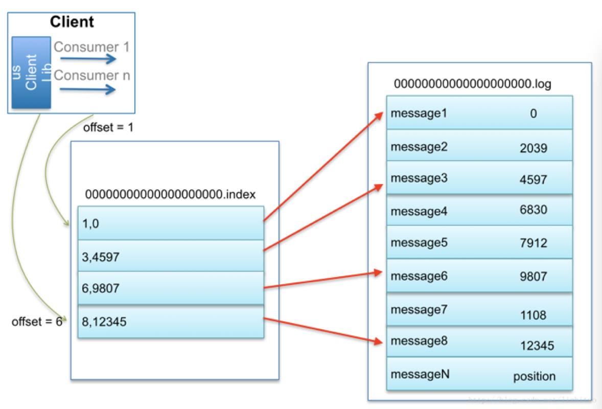

# kafka概念

## Q&A

- kafka是什么
- kafka体系结构
- kafka设计理念
- kafka安装部署
- kafka producer和consumer

## kafka关键词

- 分布式发布-订阅
- LInkedIn公司开发
- Scala与java开发
- 分布式的、可划分的。支持多订阅者
- 冗余备份机制
- 可重复性消费kafka(起到2个作用)
  - 降低系统组网复杂度
  - 降低编程复杂度，各个子系统不再是相互协商接口。子系统为可插拔式，kafka作为高速数据总线用

## kafka特点

- 同时为发布和订阅提供高吞吐量。kafka每秒可以生产约25万消息(50MB)、每秒处理55万消息(110MB),轻松百万级吞吐量
- 可进行持久化操作，将消息持久化到磁盘。因此可用于批量消费，例如ETL，以及实时应用程序。将数据持久化到磁盘以及通过设置replication防止数据丢失
- 分布式系统，易于向外扩展。所有的producer、broker和consumer均为分布式存在。可直接在线扩展集群机器
- 消息被处理的状态由consumer端维护，而不是由server端维护，消费数据失败时能自动平衡
- 支持online和offline的场景

## kafka的简介

### 设计关注重点

- 为生产者和消费者提供一个通用的API
- 消息持久化
- 高吞吐量，可以满足百万级别消息处理
- 对分布式和扩展性的支持

### kafka基本的架构

- 生产者发布一个消息机制到kafka的一个主题(topic)
- topic由扮演kafkaserver角色的broker提供
- 消费者订阅这个主题(topic)、然后从中获取数据

## kafka如何解决查找效率的问题

### kafka解决查找效率的两大法宝

#### 数据分段

- kafka解决查询效率的手段之一是将数据分段

#### 为数据建立索引

- 为了进一步提高查找效率，kafka为每个分段后的数据文件建立了索引文件，文件名与数据文件的名字是一样的，只是文件扩展名为.index
- 索引文件中包含若干个索引条目，每个条目表示数据文件中一条Message的索引
- 索引包含两个部分（均为4字节的数字），分别为相对应的offset和position
- 索引优化：稀疏存储，每隔一定字节的数据建立一条索引

## 消息队列分类

### 点对点

- 消息 **生产者 生产消息发送到queue**中，然后消息 **消费者 从queue中取出并且消费消息**
- 消息 **被消费** 以后，queue中被消费的消息已弹出，不再存储，所以消费者不可能消费到已经被消费的消息
- queue支持存在多个消费者，但是对于一条消息而言，只会被一个消费者消费到

### 发布订阅

- 消息生产者(发布)将消息发布到topic中，同时有多个消费者(订阅)消费该条消息。和点对点方式不同，发布到topic的消息会被所有订阅者消费

## 常用消息队列MQ对比

- RabbitMQ：支持协议多，非常重量级消息队列，对路由(routing)、负载均衡(load balance)或者数据持久化都有很好的支持
- ZeroMQ：号称最快的消息队列系统，尤其是针对大吞吐量的需求场景，擅长高级/复杂的队列，但是技术也复杂，并且只提供非持久性的队列
- ActiveMQ：Apache下的一个子项，类似ZeroMQ，能够以代理人和点兑点的技术实现队列
- Redis：是一个key-value的NoSql数据库，也支持MQ功能，数据量较小，性能优于RabbitMQ，但是数据量超过10k性能太差，较小数据量适用

## kafka部署架构图


## kafka基本概念

### Topic

- 特指kafka处理的消息源(feeds of message)的不同分类

### Partition

- Topic物理上的分组，一个Topic可以分为多个partition，每个partition是一个有序的队列。partition中的每条消息都会被分配一个有序的id(offset)

### Message

- 消息，是通信的基本单位，每个producer可以向一个topic(主题)发布一些消息

### Producer

- 消息和数据的生产者，向kafka的一个topic发布消息的过程叫做producers

### Consumer

- 消息和数据消费者，订阅topic并处理其发布消息的过程叫做consumers

### Broker

- 缓存代理，kafka集群中的一台或多台服务器称为broker

## Producers

- Producer将消息发布到指定的Topic中，同时Producer也能决定将消息归属于那个partition。例如基于 `round-robin` 方式或者通过其他的一些算法等
- 消息和数据生产者，想kafka的一个topic发布消息的过程叫做producers
- 异步发送
  - 批量发送可以有效提高发送效率，kafka producer的异步发送模式允许进行批量发送，先将消息缓存在内存中，然后一次批量 请求发送出去

## Brokers

- Broker： 缓存代理，kafka集群中 一台 或 多台 服务器统称为broker
- 为了减少磁盘写入的次数，broker会将消息暂时缓存(buffer)起来，当消息的个数(或大小size)达到一定的阈值时，再flush到磁盘，从而减少磁盘io的次数

## Broker的无状态机制

- broker没有副本机制，一旦broker宕机，改broker的消息都将不可用
- broker不保存订阅者(consumer)的状态，由订阅者自己保存
- 无状态导致消息的删除较为困难(可能删除的消息正在被订阅)。kafka采用基于时间的SLA(服务水平保证)。将消息保存一定的时间(配置)后数据会被删除
- 消息订阅者可以rewind back到任意位置重新进行消费，当订阅者故障时，可以选择最小的offset进行进行重新消费消息

## Consumers

- 消息和数据消费者，订阅topic并处理其发布消息的过程叫做consumer
- 本质上kafka只支持topic，每个group中可以有多个consumer，但是发送到topic的消息，只会被此次订阅的topic的group中的一个consumer消费
- 在kafka中，可以认为一个group是一个`订阅者`，一个topic中的每个partitions 只会被一个`订阅者(group)`中的一个consumer消费。但是一个consumer可以消费多个partitions中的消息，kafka只能保证单个partition中的消息被某个consumer消费时，消息是有序的。 但从topic的角度上看消息可能是无序的
- kafka的设计原理决定，对于一个topic，同一个group中不能有多余partition个数的consumer同时消费，否则将意味着某些consumer将永远无法获得消息
  - 备注：一个partition中的消息只会被group中的一个group消费
  - 每个group中consumer消息消费相互独立

## Consumer Group

- 允许consumer group(包含多个consumer，例 一个集群同事消费)，对一个topic进行消费，不同的consumer group直接独立订阅
- 为了减小对consumer group中不同consumer之间的分布式协调开销，指定partition为最小的并行消费单位，即一个group内的consumer只能消费不同的partition

## Topic/Log

- 一个topic可以认为是一类消息，每个 topic 将被分成多partition(分区)，每个partition在存储层面append log文件。任何发布到此partition的消息都会被直接追加到log文件的尾部。任何发布到此partition的消息都会被直接追加到log文件的尾部，每条消息在文件中的文字称为offset(偏移量)。partition是以文件的形式存储在文件系统中
- Logs文件根据broker中的配置要求，保留一定时间后删除来释放磁盘空间
  

## Partitions

- topic物理上的分组，一个topic可以有多个partition，每个partition是一个有序的队列
- parition中每条消息都会被分配一个有序的偏移量id(offset)
- partition设计的目的：
  - kakfak基于文件存储。通过分区，可以将日志内容分散到多个server上，以达到避免文件大小达到单机磁盘的上限。每个partition都会被当前server(kafka实例)保存
  - 可以将一个topic切分为多个partition，来提高消息生产保存/消费的效率
  - 越多的partitions意味着可以容纳更多的consumer，可以有效的提升并发消费能力

## Messages

- message消息：是kafka通信的基本单位，每个producer可以向一个topic发布消息
- kafka中的message是以topic为基本单位组织的，不同的topic之间是相互独立的。每个topic又可以分成几个不同的partition(每个topic有几个partition是在创建topic时指定的)，每个partition存储一部分message
- partition中的每条message包含了以下三个属性
  - offset                    		类型： long
  - MessageSize               类型：int32
  - data 							对应message的具体类容
    

## Offset

- 每条消息在文件中的位置称为offset(偏移量)。offset是一个long类型数字，他唯一标记一条消息。
- kafka不提供其他额外的索引机制存储offset，kafka中几乎不允许对消息进行`随机读写`
- partition中的每条message由offset来表示他在这个partition中的偏移量，该offset并不是在当前message在partition数据文件中国实际存储的位置，而是一个逻辑上的值，由offset唯一确定了partition中的一条message。因此，可以认为offset是partition中message的id
- 怎样记录每个consumer处理的信息状态？
  - 在kafka中仅保存每个consumer已处理数据的offset(已提交offset)。这样设计的好处
    - 保存的数据量少
    - 当consumer出错时，方便重跑数据，consumer重启处理数据时，只需从最近的offset开始处理即可

## kafka的消息处理机制

- 发送到partitions中的消息会按照它接受的顺序追加到日志中
- 对于消费者而言，他们消费消息的顺序和日志中消息顺序一致
- 如果Topic 的 `replication faction` 为N，那么允许N-1个kafka实例失效
- kafka对消息的重复、丢失、错误以及顺序没有严格要求
- kafka提供 at-least-once delivery，即当consumer宕机后，有些消息可能会被重复delivery
- kafka为每条消息计算CRC(循环冗余校验)校验，用于错误检测，crc校验不通过的消息会被直接丢弃
- ack校验，当消费者消费成功，返回ack信息

## 数据传输的事务定义

- At most once:  消息最多一次只发送一次，无论成功与否，将不会重发
  - at most once: 消费者fetch消息，然后保存offset，接着处理消息
  - 当client保存offset之后，如果在消息处理过程中出现异常，导致部分消息未能继续处理
  - 那么之后 `未处理` 的消息将不能被fetech到，这就是 at most once
- at least once：消息至少发送一次，如果消息未能成功接收，可能会重发，知道接收成功
  - at least once :消费者fetch消息，然后处理消息接着保存offset
  - 如果消息处理成功之后，但是在保存offset阶段zookeeper异常导致操作未能执行成功
  - 这就导致接下来再次fetch时可能货到上次已经处理过的消息，这就是 `at least once`
  - 原因是offset每天及时的提交给zookeeper，zookeeper恢复正常还是之前的offset状态
- exactly once：消息只会发送一次
  - exactly once： kafka中并没有严格的去实现(基于2阶段提交，事务)，认为这种策略在kafka中午没有必要的
- 通常情况下 `at least once`是我们首选 (相比at most once而言，重复接收数据总比丢失数据更好)

## kafka存储策略

- kafka一topic来进行消息管理，每个topic包含多个partition，每个partition对应一个逻辑log，由多个segment组成。
- 每个segment中存储多条消息(见下图)，消息id由其逻辑位置决定，即从消息id可直接定位到消息存储的位置，避免id到位置的额外映射
- broker收到发布消息到对应partition的最后一个segment上添加该信息
  

- 每个part在内存中对应一个index，记录每个segment中的第一条消息偏移
- 发布这发送到某个topic的 消息会被均匀的分布到多个part上（随机或根据用户指定的回调函数进行分布）
- broker收到发布消息网对应的part的最后一个segment上添加该信息，当某个segment上的消息条数达到配置的值或消息发布时间超过时间阈值时，segment上的消息会被flush到磁盘。只有flush到磁盘上的消息才能被订阅者订阅到
- segment达到一定的大小后将不会再往改segment写数据，broker会创建新的segment

## kafka数据传输

- 发布者每次可发布多条消息(将消息加到一个消息集合中发布)，sub每次迭代一条消息。
- 不创建单独的cache，使用系统的page cahche。发布者顺序发布，订阅者通常比发布者滞后一点点，直接使用linux的page cache效果也比较好，同时减少了cache管理及垃圾回收的开销
- 使用sendfile优化网络传输，减少一次内存拷贝

## kafka的消息发送流程

- 由于kafka broker会持久化数据到磁盘，broker没有内存压力。因此，consumer非常适合采用pull的方式消费数据

  - producer向kafka(push)推数据
  - consumer向kafka(pull)拉数
  

- 消息处理的优势

  - 简化kafka设计
  - consumer根据消费能力自主控制消息拉取速度
  - consumer根据自身情况自主选择消费模式，例如重复消费，从尾端开始消费，批量消费等
  - kafka集群接收到producer发过来的消息后，将其持久化到硬盘，并保留消息指定时长(配置),而不关注消息是否被消费

## kafka设计实现原理

- 直接使用linux文件系统的page cache，来高效缓存数据，减少cache管理和gc开销
- 显示分布式，即所有的producer、broker、consumer都会有多个、均为分布式的
  - producer个broker直接没有负载均衡机制
  - broker个consumer之间利用zookeeper进行负载均衡
  - 所有的broker和consumer都会在zookeeper中进行注册，且zookeeper中会保存他们的一些元数据信息，如果某个broker或consumer发生了变化，其他的的broker和consumer都会得到通知
- kafka以topic来进行消息管理，发布者发到某个topic的消息会被均匀的分不到多个partition上
- 每个topic包含多个partition，每个partition对应一个逻辑log，有多个segment组成
- 每个segment中存储多条消息，消息id由其逻辑位置决定。即消息id可直接定位到消息的存储位置，避免id位置的额外映射
- 每个partition在内存中对应一个index，记录每个segment中的第一条消息偏移
- 当某个segment上的消息条数达到 配置值 或 消息发布时间超过阈值时。segment上的消息会被flush到磁盘。只有flush到磁盘的上的消息才能被订阅者订阅。segment达到一定的大小后将不会再网该segment写数据，broker会创建新的segment

## kafka通信协议

- kafka的producer、broker和consumer之间采用的是一套自研基于TCP协议层的协议，根据业务需求定制，而不是一套类似protocol buffer的通用协议

### 基本数据类型

- 定长数据类型：int8、int32和int64。对应java中的byte、short、int和long
- 变长数据类型：bytes和string。变长的数据类型由两部分组成，分别是一个有符号整数N(表示内容的长度)和N个字节的内容。其中N为-1表示内容为null值， bytes的长度由int32表示，string的长度由int16表示
- 数组：数组由两部分组成，分别是一个由int32类型的数字表示数组长度N和N个元素

### kafka通讯的基本单位

**Request/Response**

- 基本结构:

    **RequestOrResponse => MessageSize (RequestMessage | ResponseMessage)**

    | 名称        | 类型  | 描述                                      |
    | ----------- | ----- | --------------------------------------- |
    | MessageSize | int32 | 表示RequestMessage或ResponseMessage的长度 |
    |RequestMessage ResponseMessage|____|表示Request或者Response的内容|

- 通讯过程

  - 客户端打开与服务端的Socket
  - 向socket写入一个int32的数字(数字表示这次发送的Request的有多少字节)
  - 服务端先读出这个int32的整数从而获取此次Request的大小
  - 然后读取对应的字节数的数据，从而得到本次Request的具体内容
  - 服务端处理了请求后，也采用统一的方式来发送响应给客服端

### RequestMessage结构

**RequestMessage => ApiKey ApiVersion Correlation ClientId Request**

| 名称        | 类型   | 描述                                                         |
| ----------- | ------ | ------------------------------------------------------------ |
| ApiKey      | int16  | 表示本次请求的API编号                                        |
| ApiVersion  | int16  | 表示请求的API版本， 有了版本后既可以做到向后兼容             |
| Correlation | int32  | 由客户端指定的一个数字唯一标识本次请求的id，服务端在处理完请求后也会把同样的Correlation写到Response中，这样客户端就能把某个请求和对应的响应关联起来 |
| ClientId    | string | 客户端指定的用来描述客户端的字符串，会被用来记录日志和监控，它唯一标识一个客户端 |
| Request     | ____   | Request的具体内容                                            |

### ResponseMessage结构

ResponseMessage => CorrelationId Response

| 名称          | 类型  | 描述                                                         |
| ------------- | ----- | ------------------------------------------------------------ |
| CorrelationId | int32 | 对应的Request的CorrelationId                                 |
| Response      | ----- | 对应Request的Response，不同的Request的Response的字段是不一样的 |

- kafka采用的是经典的Reactor(同步IO)模式。也就是1个Acceptor响应客户端的连接请求，N个Processor来读取数据，这种模式可以构建出高性能的服务器

- Message：Producer生产消息=> 键-值对

- Message => Crc MagicByte Attribute Key Value

  | 名称      | 类型  | 描述                                                         |
  | --------- | ----- | ------------------------------------------------------------ |
  | CRC       | int32 | 标识本条消息(不包括CRC字段本身)的校验码                      |
  | MagicByte | int8  | 标识消息格式的版本，用来做向后兼容，目前值为0                |
  | Attribute | int8  | 标识本条消息的元数据，目前最低两位用来标识压缩格式           |
  | Value     | bytes | 标识本条消息的value,kafka支持小时嵌套。可以把一条消息作为value放到另外一条消息里面 |

### MessageSet

用来组合多条Message，他在每条Message的基础上加上了Offset的MessageSize

MessageSet => [Offset MessageSize Message]

| 名称        | 类型  | 描述                                                         |
| ----------- | ----- | ------------------------------------------------------------ |
| Offset      | int64 | 作为log中的序列号，Prodcuer在生产消息的时候还不知道具体的值是什么，可以随便填个数字进去 |
| MessageSize | int32 | 标识本条Message的大小                                        |
| Message     | ----- | 标识本条Message的具体内容                                    |

## kafka的分布式实现

- 一个Topic的多个partitions， 被分布在kafka集群中的多个server上，每个server(具体kafka实例)负责partitions中消息的读写操作
- kafka可以配置partitions需要备份的个数(replicas),每个partition将会被备份到多台机器上，以提高可用性
- 基于replicated方案，那么就意味着需要对多个备份进行调度
- 每个partition都有一个server为 `leader`, leader 负责所有的读写操作，如果leader失效，那么将会有其他的follower来接管(成为新的leader)
- follower只是单调的和leader跟进，同步消息即可
- 由此可见作为leader的server承载了全部的请求压力，因此从集群的整体考虑，有多少个partition就意味着有多少个 `leader`
- kafka会将 `leader`均衡的分散在每个实例上，来确保整体性能的稳定

## kafka数据持久化

### 数据持久化

- 发现线性的访问磁盘，很多时候比随机的内存访问快得多
- 传统的使用内存作为磁盘的缓存
- kafka直接将数据写入到日志文件中

### 日志数据持久化

- 写操作：通过将数据追加到文件中实现
- 读操作：读的时候从文件中毒就好了

### 对比JVM特性

- java对象占用空间是非常大的，差不多是要缓存的数据的两倍甚至更高
- 随着堆中数据量的增加，垃圾回收变的越来越困难
- 优势：
  - 读操作不会阻塞写操作和其他操作，数据大熊啊不对性能才是影响
  - 没有容量限制(相对于内存来说)的磁盘空间简历消息系统
  - 线性访问磁盘，速度快，可以保存任意一段时间

# kafka 安装

- 安装java jdk

- 安装zookeeper

- 安装kafka

- 启动zookeeper

  bin/zkServer.sh start

- 停止zookeeper

  bin/zkServer.sh stop

- 查看zookeeper状态

  bin/zkServer.sh status

- 启动kafka

  bin/kafka-server-start.sh -daemon config/server.properties

- 停止kafka

  bin/kafka-server-stop.sh

- [参考](https://www.jianshu.com/p/c74e0ec577b0)

## kafka常用操作

### 创建Topic主题

`bin/kafka-topic.sh --create --zookerper 172.16.2.10:2181,172.16.2.11:2181,172.16.2.13:2181 -- replication-factor 3 --partitions 1 --topic testkafkatopic`

### 查看topic信息

`bin/kafka-topics.sh --describe --zookeeper 172.16.2.10:2181,172.16.2.11:2181,172.16.2.13:2181 --topic testkafkatopic`

### 查看topic的分区情况

`bin/kafka-list-topic.sh --zookeeper 172.16.2.10:2181,172.16.2.11:2181,172.16.2.13:2181 --topic testkafkatopic`

### 生产者命令

`bin/kafka-console-producer.sh --list --broker 172.16.2.10:9092,172.16.2.11:9092,172.16.2.13:9092 --list topic testkafkatopic`

### 消费者命令

`bin/kafka-console-consumer.sh --from-beginning --bootstrap-server 172.16.2.10:9092,172.16.2.11:9092,172.16.2.13:9092 --topic testkafkatopic`

## kafka 核心配置

```
# server.properties中所有配置参数说明(解释)如下列表：

# 参数
# 说明(解释)

broker.id =0
# 每一个broker在集群中的唯一表示，要求是正数。当该服务器的IP地址发生改变时，broker.id没有变化，则不会影响consumers的消息情况

log.dirs=/data/kafka-logs
# kafka数据的存放地址，多个地址的话用逗号分割 /data/kafka-logs-1，/data/kafka-logs-2

port =9092
# broker server服务端口

message.max.bytes =6525000
# 表示消息体的最大大小，单位是字节

num.network.threads =4
# broker处理消息的最大线程数，一般情况下不需要去修改

num.io.threads =8
# broker处理磁盘IO的线程数，数值应该大于你的硬盘数

background.threads =4
# 一些后台任务处理的线程数，例如过期消息文件的删除等，一般情况下不需要去做修改

queued.max.requests =500
# 等待IO线程处理的请求队列最大数，若是等待IO的请求超过这个数值，那么会停止接受外部消息，应该是一种自我保护机制。

host.name
# broker的主机地址，若是设置了，那么会绑定到这个地址上，若是没有，会绑定到所有的接口上，并将其中之一发送到ZK，一般不设置

socket.send.buffer.bytes=100*1024
# socket的发送缓冲区，socket的调优参数SO_SNDBUFF

socket.receive.buffer.bytes =100*1024
# socket的接受缓冲区，socket的调优参数SO_RCVBUFF

socket.request.max.bytes =100*1024*1024
# socket请求的最大数值，防止serverOOM，message.max.bytes必然要小于socket.request.max.bytes，会被topic创建时的指定参数覆盖

log.segment.bytes =1024*1024*1024
# topic的分区是以一堆segment文件存储的，这个控制每个segment的大小，会被topic创建时的指定参数覆盖

log.roll.hours =24*7
# 这个参数会在日志segment没有达到log.segment.bytes设置的大小，也会强制新建一个segment会被 topic创建时的指定参数覆盖

log.cleanup.policy = delete
# 日志清理策略选择有：delete和compact主要针对过期数据的处理，或是日志文件达到限制的额度，会被 topic创建时的指定参数覆盖

log.retention.minutes=3days
# 数据存储的最大时间超过这个时间会根据log.cleanup.policy设置的策略处理数据，也就是消费端能够多久去消费数据

# log.retention.bytes和log.retention.minutes任意一个达到要求，都会执行删除，会被topic创建时的指定参数覆盖
log.retention.bytes=-1

# topic每个分区的最大文件大小，一个topic的大小限制 = 分区数*log.retention.bytes。-1没有大小限log.retention.bytes和log.retention.minutes任意一个达到要求，都会执行删除，会被topic创建时的指定参数覆盖

log.retention.check.interval.ms=5minutes
# 文件大小检查的周期时间，是否处罚 log.cleanup.policy中设置的策略

log.cleaner.enable=false
# 是否开启日志压缩

log.cleaner.threads = 2
# 日志压缩运行的线程数

log.cleaner.io.max.bytes.per.second=None
# 日志压缩时候处理的最大大小

log.cleaner.dedupe.buffer.size=500*1024*1024
# 日志压缩去重时候的缓存空间，在空间允许的情况下，越大越好

log.cleaner.io.buffer.size=512*1024
# 日志清理时候用到的IO块大小一般不需要修改

log.cleaner.io.buffer.load.factor =0.9
# 日志清理中hash表的扩大因子一般不需要修改

log.cleaner.backoff.ms =15000
# 检查是否处罚日志清理的间隔

log.cleaner.min.cleanable.ratio=0.5
# 日志清理的频率控制，越大意味着更高效的清理，同时会存在一些空间上的浪费，会被topic创建时的指定参数覆盖

log.cleaner.delete.retention.ms =1day
# 对于压缩的日志保留的最长时间，也是客户端消费消息的最长时间，同log.retention.minutes的区别在于一个控制未压缩数据，一个控制压缩后的数据。会被topic创建时的指定参数覆盖

log.index.size.max.bytes =10*1024*1024
# 对于segment日志的索引文件大小限制，会被topic创建时的指定参数覆盖

log.index.interval.bytes =4096
# 当执行一个fetch操作后，需要一定的空间来扫描最近的offset大小，设置越大，代表扫描速度越快，但是也更好内存，一般情况下不需要搭理这个参数

log.flush.interval.messages=None
# log文件”sync”到磁盘之前累积的消息条数,因为磁盘IO操作是一个慢操作,但又是一个”数据可靠性"的必要手段,所以此参数的设置,需要在"数据可靠性"与"性能"之间做必要的权衡.如果此值过大,将会导致每次"fsync"的时间较长(IO阻塞),如果此值过小,将会导致"fsync"的次数较多,这也意味着整体的client请求有一定的延迟.物理server故障,将会导致没有fsync的消息丢失.

log.flush.scheduler.interval.ms =3000
# 检查是否需要固化到硬盘的时间间隔

log.flush.interval.ms = None
# 仅仅通过interval来控制消息的磁盘写入时机,是不足的.此参数用于控制"fsync"的时间间隔,如果消息量始终没有达到阀值,但是离上一次磁盘同步的时间间隔达到阀值,也将触发.

log.delete.delay.ms =60000
# 文件在索引中清除后保留的时间一般不需要去修改

log.flush.offset.checkpoint.interval.ms =60000
# 控制上次固化硬盘的时间点，以便于数据恢复一般不需要去修改

auto.create.topics.enable =true
# 是否允许自动创建topic，若是false，就需要通过命令创建topic

default.replication.factor =1
# 是否允许自动创建topic，若是false，就需要通过命令创建topic

num.partitions =1
#每个topic的分区个数，若是在topic创建时候没有指定的话会被topic创建时的指定参数覆盖


#########################################################################################################
# 以下是kafka中Leader,replicas配置参数																	   #	
#########################################################################################################

controller.socket.timeout.ms =30000
# partition leader与replicas之间通讯时,socket的超时时间

controller.message.queue.size=10
# partition leader与replicas数据同步时,消息的队列尺寸

replica.lag.time.max.ms =10000
# replicas响应partition leader的最长等待时间，若是超过这个时间，就将replicas列入ISR(in-sync replicas)，并认为它是死的，不会再加入管理中

replica.lag.max.messages =4000
# 如果follower落后与leader太多,将会认为此follower[或者说partition relicas]已经失效
# 通常,在follower与leader通讯时,因为网络延迟或者链接断开,总会导致replicas中消息同步滞后
# 如果消息之后太多,leader将认为此follower网络延迟较大或者消息吞吐能力有限,将会把此replicas迁移
# 到其他follower中。在broker数量较少,或者网络不足的环境中,建议提高此值.

replica.socket.timeout.ms=30*1000
# follower与leader之间的socket超时时间

replica.socket.receive.buffer.bytes=64*1024
# leader复制时候的socket缓存大小

replica.fetch.max.bytes =1024*1024
# replicas每次获取数据的最大大小

replica.fetch.wait.max.ms =500
# replicas同leader之间通信的最大等待时间，失败了会重试

replica.fetch.min.bytes =1
# fetch的最小数据尺寸,如果leader中尚未同步的数据不足此值,将会阻塞,直到满足条件

num.replica.fetchers=1
# leader进行复制的线程数，增大这个数值会增加follower的IO

replica.high.watermark.checkpoint.interval.ms =5000
# 每个replica检查是否将最高水位进行固化的频率

controlled.shutdown.enable =false
# 是否允许控制器关闭broker ,若是设置为true,会关闭所有在这个broker上的leader，并转移到其他broker

controlled.shutdown.max.retries =3
# 控制器关闭的尝试次数

controlled.shutdown.retry.backoff.ms =5000
# 每次关闭尝试的时间间隔

leader.imbalance.per.broker.percentage =10
# leader的不平衡比例，若是超过这个数值，会对分区进行重新的平衡

leader.imbalance.check.interval.seconds =300
# 检查leader是否不平衡的时间间隔

offset.metadata.max.bytes
# 客户端保留offset信息的最大空间大小


#########################################################################################################
# kafka中zookeeper参数配置                                                                                #
#########################################################################################################

zookeeper.connect = localhost:2181
# zookeeper集群的地址，可以是多个，多个之间用逗号分割 hostname1:port1,hostname2:port2,hostname3:port3

zookeeper.session.timeout.ms=6000
# ZooKeeper的最大超时时间，就是心跳的间隔，若是没有反映，那么认为已经死了，不易过大

zookeeper.connection.timeout.ms =6000
# ZooKeeper的连接超时时间

zookeeper.sync.time.ms =2000
# ZooKeeper集群中leader和follower之间的同步实际那
```

## kafka的一致性

MQ要实现从producer到consumer直接的可靠消息传送和分发。

传统的MQ系统通常都是通过broker和consumer间的(ack)`确认` 机制实现的，并在broker保存消息分发的状态。即使这样一致性也是很难保证(kafka 也支持ack) 

kafka保证一致性的做法是由consumer自己保存状态，也不要任何确认。这样虽然consumer负担更重，但其实现更灵活，因为不管consumer上任何原因导致需要从小处理消息，都可以再次从broker获取消息。

## kafka的高可用性

kafka可以将log文件复制到其他topic的分隔点(可以看成是server)。

当一个server在集群中fails，允许自动的failover到恰的复制的server，所以在这种情况下消息可以继续存在

## kafka的可拓展性

当需要增加的broker节点时，新增的broker会想zookeeper注册，而producer及consumer会根据注册zaizookeeper上的watcher感知这些变化，并及时作出调整。这样就保证了添加或去除broker时，各个broker之间仍能自动实现负载均衡

## kafka的负载均衡

- producer和broker之间没有负载均衡机制
- 负载均衡可以分为两个部分：
  - producer发消息的负载均衡
  - consumer读消息的负载均衡
- producer有一个当前所以broker的连接池，当一个消息需要发送时，需要决定发到哪个broker(即partition)
- consumer读消息时，除了考虑当前的broker情况外，还要考虑其他consumer的情况，才能决定从哪个partition读取消息
- 多个partition需要选取出leader partition，lead partition负责读写，broker和consumer直接利用zookeeper进行负载均衡
- 所有的broker和consumer都会在broker中进行注册，且zookeeper会保存他们的一些元数据信息。如果某个broker或consumer发生了变化，所有其他已注册的broker和consumer都会得到通知

## kafka的zero-copy

kafka采用Zero-Copy提高发送性能。船艇的数据发送需要发送 E`4次上下文切换` 。采用sendfile系统调用之后，数据直接在内核态交换，系统上下文切换减少为2次。根据测试结果，可以提高60%的数据发送性能。


- Sendfile系统调用


## kafak的Zookeeper协调控制

- 管理broker与consumer的动态加入与离开
- 触发负载均衡，当broker或consumer加入或离开时会触发负载均衡算法，使得一个consumer group内的多个consumer的订阅负载均衡
- 维护消费关系及每个partition的消费信心
- zookeeper上的细节：
  - 每个broker启动会在zookeeper上注册一个临时的broker registry，包含broker的 `ip地址` 和 `端口号` 所存储的topics和partitions信息
  - 每个consumer启动后会在zookeeper上注册一个临时额consumer registry，包含consumer所属的consumer group以及订阅的topics
  - 每个consumer group会关联一个临时的 owner registry 和一个持久的 offset registry。对于订阅的每个 partition 包含一个 owner registry ，内容为订阅这个 partition 的 consumer id ，同事包含一个 offset registry，内容为上一次订阅的offset
